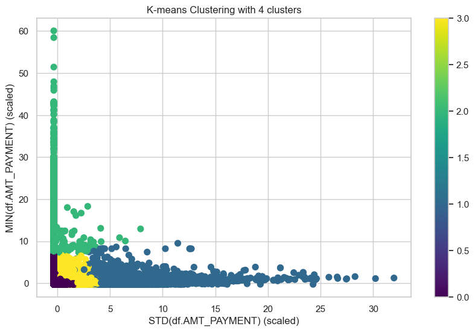
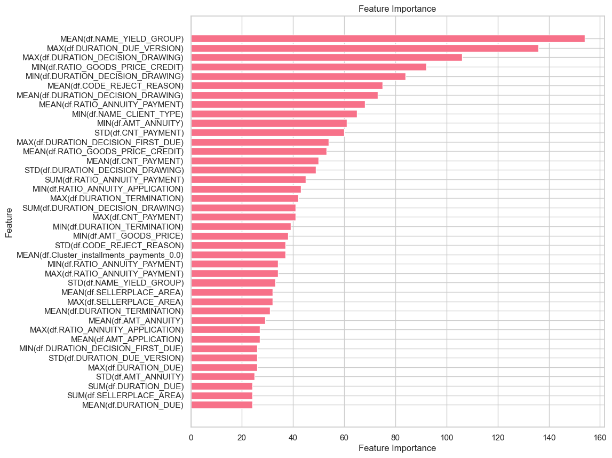
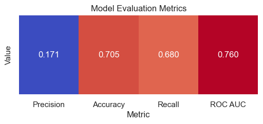
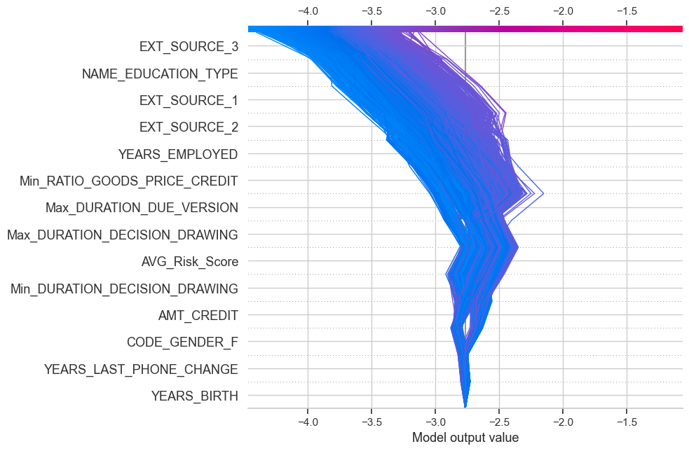

# Home-Credit-Default-Risk
## Overview
The project inspects Home Credit Default Risk Dataset, which is based on (and is similar to) Kaggle dataset. 

The primary objectives are to clean the data, perform exploratory data analysis, statistical analysis, find best features for model building, and apply various machine learning models for target variable. Home Credit strives to provide loans for people without credit histories. The main goal is to help Home Credit provide loans for those in need, while simultaneously rejecting Defaulting Customers.

## Dataset
Dataset is similar and based on [Kaggle datasets](https://storage.googleapis.com/341-home-credit-default/home-credit-default-risk.zip).

## Python Libraries
pydantic==2.8.2
fastapi==0.111.0
pandas==1.5.3
joblib==1.4.2
numpy==1.24.3
seaborn==0.13.2
matplotlib==3.7.1
featuretools==1.31.0
polars==1.0.0
scikit-learn==1.4.2
lazypredict==0.2.12
lightgbm==4.3.0
warnings==0.0.1
scipy==1.10.1
statsmodels==0.14.2
os==0.1.1
duckdb==1.0.0
copy==0.1.0
shap==0.45.1
optuna==3.6.1

## Findings

* Exploratory Data Analysis (EDA): Dataset is combined out of 7 tables, current loan application, previous loan application and previous loan repaying information, as well as information from Credit Bureau. Data is collected for people 20s-70s. Gender distribution is balanced, but female makes up a slight majority. Most people take the exact amount of credit they need for their goods (AMT_GOODS_PRICE / AMT_CREDIT is RATIO_GOODS_PRICE_CREDIT) and have Secondary education. Previous application has average risk score is dependent on many variables: Years of employment, Age, Gender. Dataset has External Sources, but they are not correlated to any of the features or each other, this shows they are derived from different datasets. 
* Correlation: Some features are linearly correlated, i.e., amount for a loan and goods price, payment due date and payment date. However, these features are interesting in comparison to each other and their ratio was instead of them. Also, datasets had a lot of derivative features provided, i.e., mode and mean of the same feature.
* Feature Engineering: Bureau Data, Cash, Position, Instalment balances describe monthly Customer behaviors. 

These features were aggregated using FeatureTool and clustered K-means. However, none of the created features were used in the final model. After aggressive feature removal via LightGBM Feature Importance, 15 top features were selected.

* Statistical Testing:  Examining data showed that Years of employment, Age, Gender, Risk Score are related to each other and probability of defaulting. But the relationship is not linear.
* Models: Features were selected through LightGBM feature importance, fitting all available features

Decision Tree and LightGBM machine learning models were tested. Class imbalance was addressed by using hyperparameter tuning on ROC AUC. Threshold tuned on Precision

* Best model: Best model was LightGBM with Precision score of 0.21, while un-tuned model with >80 parameter had Precision of 0.17.

## Suggestions for Home Credit 
* Customers that take more credit than the good price requires, are one of the main groups that the model identifies as risky. Credit amount could be tied to requested good cost.

## Future Work

- Employing dimensionality reduction techniques like Principal Component Analysis (PCA) or t-Distributed Stochastic Neighbor Embedding (t-SNE) to condense the feature space and enhance interpretability.
